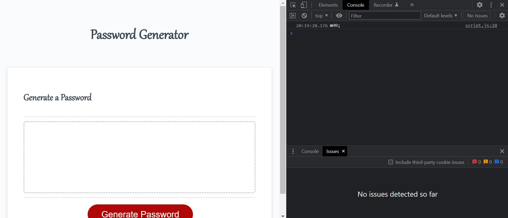
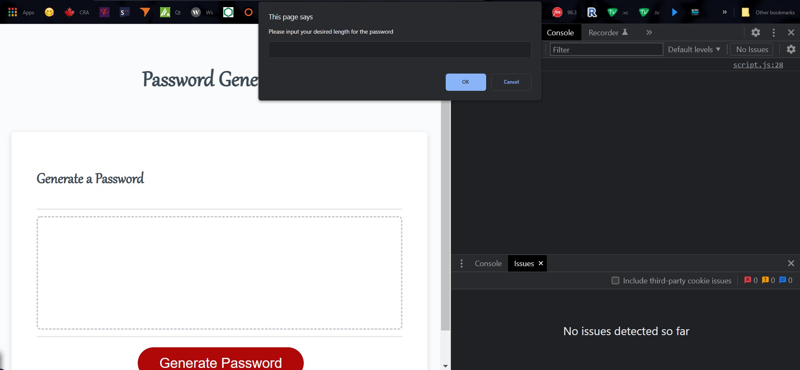

# Password generation window challenge

## description

In this end of week3 challenge we were tasked to make the javascript functional and look alike the mock example on campus description page.

I followed the acceptance criteria. But am likely sure i didnt get them all to work as intended (esp the final result, as it keep on doing the unintended constantly And im not sure how to get it to work). Please acknowledge about this if possible.

##Only Javascript was to be edited and not the html and css. changes are listed below
  
  Script code
    - Created an array (or a list) of the keys per requirements.
    - Introduced a function for the array to generate random combinations (and added a console log to test the result. "...IT WORKS!!!"
    - Introduced the required propt windows that pop up on clicking the generate password btn and made sure the7y work as intended.
    - Made 2 functions to generate a password and randomixe it but the result shown isn't as intended.
    
## Challenges
  
  - Bigest challenge ended up being: Making sure the final generated password is in intended amount of numbers specified in prompt window. but it keeps on giving variety of different unintended results when trying to combine more than 1 type of "keys" instead.
  - As previous 2 challenges i have uploaded the challenge on githum repo and netlify to make sure (just in case).
  
## Image

  
  

## Badges

